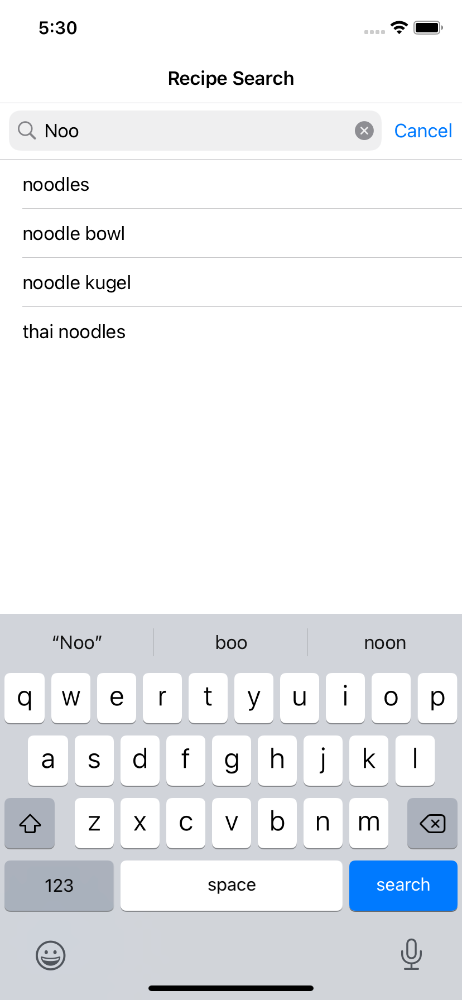
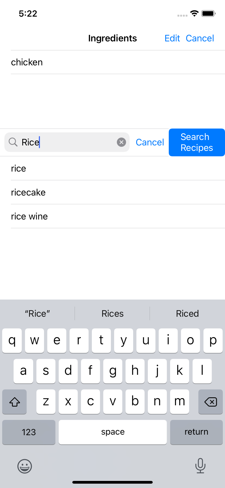
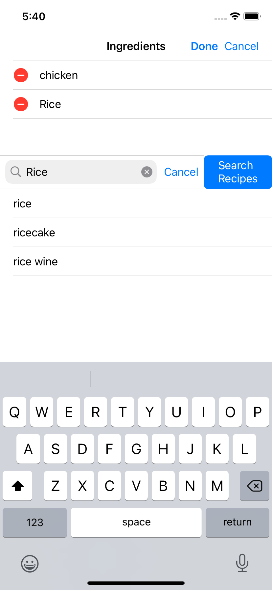
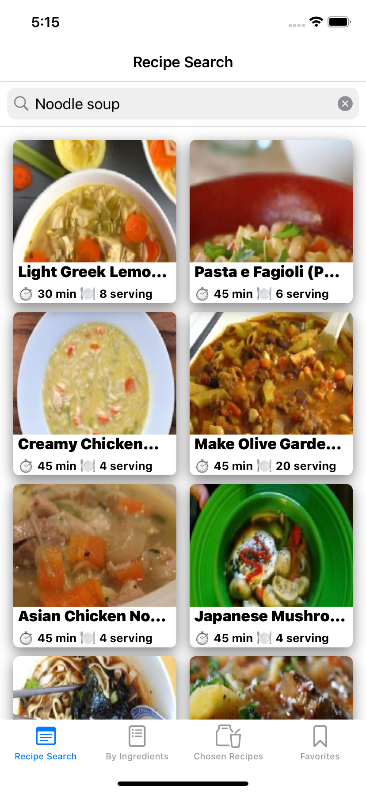
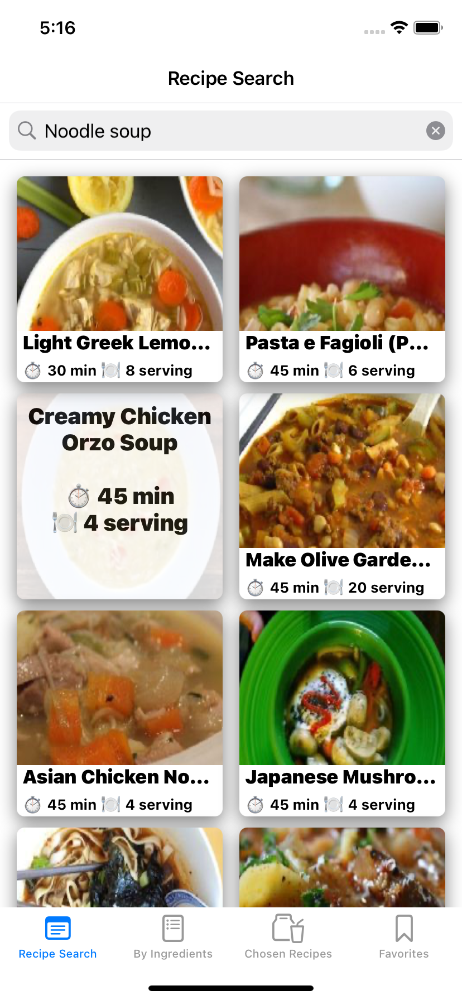
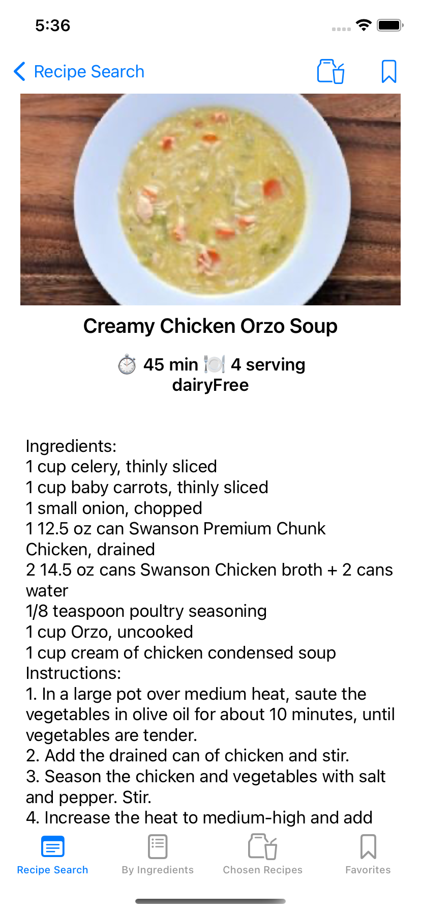
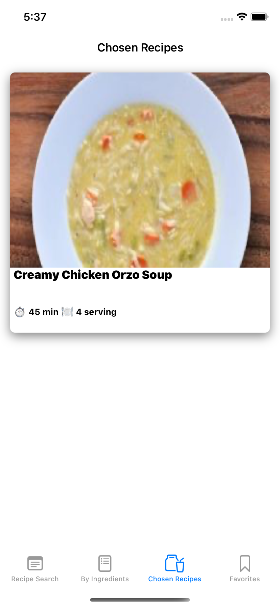
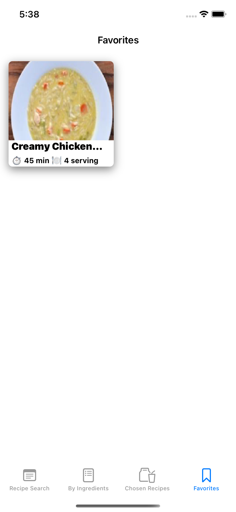

# Recipe-Whiz
This is an iOS app that provides recipe recommendations based on a direct search or a user-provided ingredients list, ranked by least 
missing ingredients. Additionally, users can queue up recipes temporarily to use while cooking and save recipes to their device.

# Getting Started
Make sure that you have the latest version of Xcode and Swift installed. After cloning/downloading the project, run it in your version 
of Xcode using the device simulator of your choice.

# Using The App
## Searching for Recipes

  
&nbsp; &nbsp; &nbsp; &nbsp;
  
&nbsp; &nbsp; &nbsp; &nbsp;
  

* **Recipe Search:** search for a recipe by name
* **By Ingredients:** enter ingredients to use in recipes
* **By Ingredients:** supports deletion
* Autocomplete available

## Results

  
&nbsp; &nbsp; &nbsp; &nbsp;
  

* Tapping the short recipe annotation will reveal the full title of the recipe with info
* **By Ingredients:** each search result will show a number in yellow, indicating the number of missing ingredients
* Tapping a search result will transfer to the recipe card view

## Recipe Card View

  

* Toggle the bag icon to add/remove the recipe from *Chosen Recipes*, which temporarily stores recipes
* Toggle the bookmark icon to add/remove the recipe from *Favorites*, which persists recipe data via Core Data
* If the recipe is a result of a **By Ingredients** search, missing ingredients will appear in yellow

## Storing Recipes

  
&nbsp; &nbsp; &nbsp; &nbsp;
  

* **Chosen Recipes** temporarily store recipes to use while cooking
* **Favorites** stores recipes via Core Data
